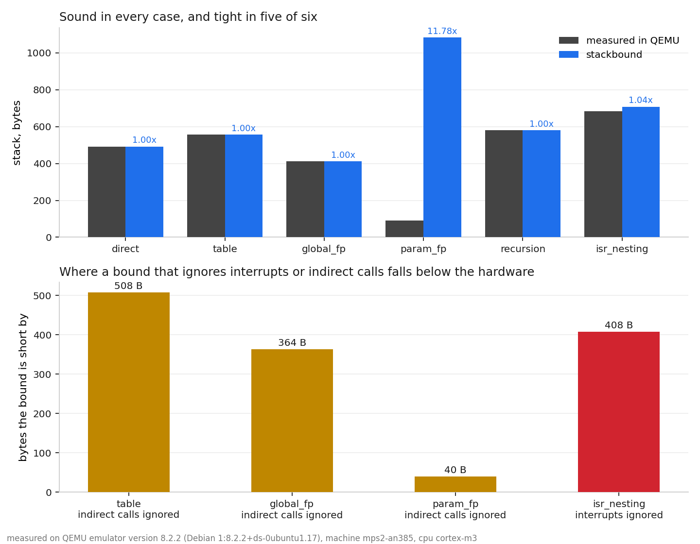
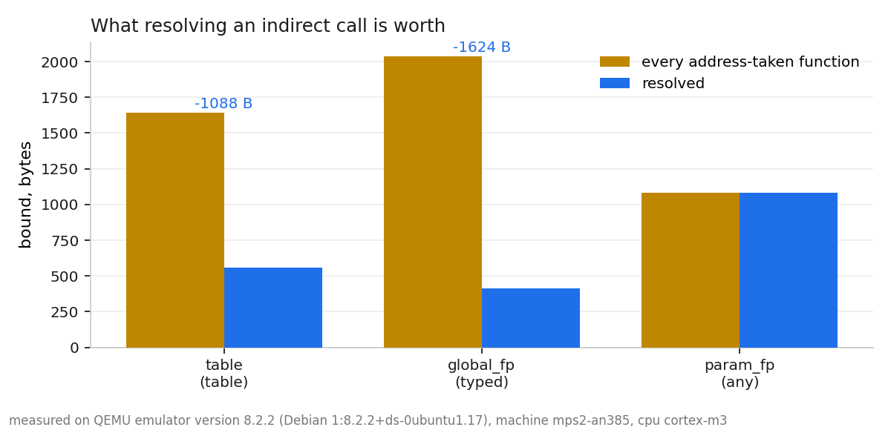

# stackbound

[](https://github.com/andrealo20/stackbound/actions/workflows/ci.yml)
[](LICENSE)
[](pyproject.toml)
[](firmware/)
[](tests/)
[](tools/sabotage.py)

**A static worst-case stack analyser for Cortex-M firmware that models interrupt
preemption and resolves indirect calls — and checks every bound it produces
against the stack the firmware actually used, measured in QEMU.**

On the six benchmark firmwares, the bound is never below the measurement, and in
five of six it is exact to the byte. A bound that ignores interrupts — which is what
every free tool surveyed below does — reports **276 bytes for a firmware that
used 684**.



| case | what it exercises | measured | bound | ratio |
|---|---|---:|---:|---:|
| `direct` | plain call chain | 492 | 492 | 1.00 |
| `table` | `const` dispatch table | 556 | 556 | 1.00 |
| `global_fp` | mutable function pointer | 412 | 412 | 1.00 |
| `param_fp` | pointer passed as an argument | 92 | 1084 | 11.78 |
| `recursion` | recursion with a stated depth | 580 | 580 | 1.00 |
| `isr_nesting` | three nested interrupts | 684 | 708 | 1.04 |

Measured on `qemu-system-arm` 8.2.2, machine `mps2-an385`, CPU `cortex-m3`: each
firmware paints its own stack at reset and reports the watermark over
semihosting, so the number on the left is produced by the hardware model and
nothing in the analyser is involved in making it.

`param_fp` is the honest one: when the pointer arrives as a function argument
nothing in the binary narrows it down, so the bound has to cover every
address-taken function in the image. That is what the fallback costs, measured
rather than asserted.

## Why this exists

The free stack analysers I could find stop in the same two places.
[`cargo-call-stack`](https://github.com/japaric/cargo-call-stack) does not
analyse indirect calls, because the machine code alone carries no type
information, and it cannot compute a whole-program maximum when exceptions are
present — handlers appear as disconnected nodes in the call graph. The scripts
built on GCC's `-fstack-usage` output (`avstack`, `WorstCaseStack`,
`checkStackUsage`, `puncover`) have the same two gaps.

The tool that closes them, AbsInt's StackAnalyzer, is commercial, and ships
qualification kits for DO-178C, ISO 26262, IEC 61508 and EN 50128 — the standards
under which "prove the stack cannot overflow" stops being good practice and
becomes a deliverable.

So the open-source side of the field covers *direct calls, no interrupts*, and
the paid side covers the rest. `stackbound` is an attempt at the middle.

Two consequences, both measured on this benchmark:

* **Ignoring interrupts is not conservative, it is wrong.** On `isr_nesting` the
  hardware used 684 bytes and the interrupt-blind bound is 276 — short by 408.
* **Ignoring indirect calls is worse.** On `table` the blind bound is 48 against
  556 measured, short by 508 bytes, a factor of 11.6.

## How it works

### The bound

For a function $f$ with local allocation $L(f)$ and call sites $c$:

$$ S(f) = \max\Big( L(f),\; \max_{c \,\in\, \mathrm{calls}(f)} \big( d(c) + \max_{g \,\in\, T(c)} S(g) \big) \Big) $$

$d(c)$ is the stack already in use at the call site and $T(c)$ the set of
functions the call can reach. Using $d(c)$ rather than $L(f)$ is what keeps the
bound tight: a function that allocates a 512-byte buffer *after* its calls have
returned never holds the buffer and the callee at the same time, and charging
$L(f)$ at every call site would add those 512 bytes to every path through it.
Recovering $d(c)$ needs the value of `SP` at each instruction, which is what the
Thumb-2 decoder is for.

A cycle has no finite bound. Given a stated number of activations $k$ for a
strongly connected component:

$$ S(\mathrm{SCC}) = (k-1)\,\max_{\text{back edges}} d \;+\; \max_{f \,\in\, \mathrm{SCC}} S_{\mathrm{exit}}(f) $$

$k-1$ activations each reach their deepest recursion site, and the last one runs
to its own maximum. Without $k$ the component is reported unbounded.

The whole-program bound is the thread-mode depth plus the exception chain below,
because an interrupt can arrive at the deepest point of thread mode.

### Resolving indirect calls

Four tiers, tried in order, with the tier recorded for every call site so the
precision of a run is a number rather than a claim.

| tier | when | result |
|---|---|---|
| `literal` | the pointer is a constant from the literal pool | exact, one target |
| `table` | loaded from an object in a read-only section | exact: the contents are read out of the image, even when the index is unknown |
| `typed` | loaded from a mutable object whose DWARF type is a function pointer | address-taken functions with a matching signature |
| `any` | nothing is known | every address-taken function — sound, and expensive |

The pointer value is recovered by a forward dataflow over the function's control
flow graph with a meet at join points, so a table base register loaded before a
loop is still known at a call site inside it.

What this is worth, on the same firmwares:



On `table` the analysis reads the four-entry dispatch table out of `.rodata` and
returns exactly the three functions in it, excluding `cmd_orphan` whose address
is taken elsewhere — 1088 bytes less pessimism than the blind fallback. On
`global_fp` the DWARF signature excludes two decoys with different prototypes:
1624 bytes.

### Modelling exceptions

A handler runs on the stack of whatever it interrupted, on top of a
hardware-pushed frame, and can itself be preempted. Two handlers at the same
preemption priority never nest, so a chain holds at most one handler per level
and the worst case is

$$ S_{\mathrm{exc}} = \sum_{\ell \,\in\, \mathrm{levels}} \;\max_{h \,\in\, \ell} \big( F + \mathrm{align} + S(h) \big) $$

$F$ is the hardware-stacked frame: $32$ bytes for r0-r3, r12, LR, PC and xPSR, or
$104$ when an FP context is active. The extended frame counts even under lazy
stacking, because the space is reserved on entry whether or not the registers are
written. `align` is one word for the padding `STKALIGN` can insert. The
preemption level of a handler is `priority >> (PRIGROUP + 1)`; tail-chaining and
late arrival add no frame, which is why the sum is over levels and not over
handlers.

The linear formula is checked in the test suite against brute-force enumeration
of every admissible nesting order, on randomised handler sets with random
priorities and priority groupings.

Which interrupts are enabled and at what priority is set by code at run time and
cannot be read from the image. Without a configuration file `stackbound` assumes
the worst the hardware allows — every vector slot live, every priority distinct.
The configuration is what makes the number tight, and the tool says so rather
than quietly assuming interrupts are off.

### Refusing rather than guessing

* Any instruction that writes `SP` in a form the decoder does not model flags the
  function and falls back to a bound that holds under any control flow.
* A recursive component has no finite bound; without a stated depth it is
  reported as **unbounded** and `stackbound check` fails. A tool that returns a
  number here is lying.
* Literal pools are located and skipped before anything is interpreted, because a
  `.word` decoded as an instruction that happens to write `SP` corrupts
  everything downstream.

## Using it on your own firmware

The image must be an unstripped ELF built with `-g` (DWARF 4 or 5). Symbol sizes
are needed, so do not strip; DWARF is what makes the `typed` tier work, and
without it those sites fall back to `any`. If the linker script exports
`_stack_bottom` and `_stack_top` the stack region is picked up automatically,
otherwise pass `--stack-size`.

Two things cannot be read from a binary: which interrupts the firmware enables
and at what priority, and how deep a recursion goes. Both are set by code at run
time. Rather than guess, `stackbound` takes them from a configuration file:

```json
{
  "prigroup": 0,
  "fpu": false,
  "entry": "Reset_Handler",
  "handlers": {
    "Default_Handler": { "enabled": false },
    "TIM2_IRQHandler": { "priority": 64 },
    "USART1_IRQHandler": { "priority": 128 }
  },
  "recursion": { "parse_node": 8 },
  "indirect_targets": { "0x08001c42": ["on_rx", "on_tx"] },
  "any_includes_vectors": false
}
```

| key | meaning | default |
|---|---|---|
| `prigroup` | AIRCR PRIGROUP; subpriority bits are `PRIGROUP + 1` | `0` |
| `fpu` | assume an extended (FP) exception frame | `false` |
| `entry` | thread-mode root | vector 1 |
| `handlers` | per handler: raw 8-bit `priority`, and `enabled` | every vector slot enabled, every priority unknown |
| `recursion` | maximum activations per recursive function | none, so cycles are unbounded |
| `indirect_targets` | manual callee list for a call site address | resolved automatically |
| `any_includes_vectors` | let unresolved calls reach vector-table-only functions | `false` |

Every default is the conservative one. With no configuration at all, every vector
slot is assumed live at a distinct priority — so all of them can nest — and any
recursion makes the run unbounded. The configuration only ever makes the number
smaller, and the report says which assumptions produced it.

## Repository layout

```
stackbound/      the analyser
  elfinfo.py       ELF and DWARF: symbols, sections, vector table, type signatures
  thumb.py         Thumb-2 decoding, CFG, stack-pointer abstract interpretation
  indirect.py      the four resolution tiers and the dataflow behind them
  nvic.py          exception frames, priority grouping, preemption chains
  analyze.py       call graph, SCC, the whole-program bound
  report.py cli.py config.py
firmware/        six bare-metal C99 benchmark cases and their configurations
tools/           validate.py (QEMU + ablation), sabotage.py, make_figures.py
tests/           76 tests
docs/design.md   derivation, hand-check against the disassembly, mistakes made
results/         results.json and the figures generated from it
```

## Milestones

* **M0** — ELF and DWARF front end: functions, sections, vector table, canonical
  type signatures, address-taken scan over every allocated section.
* **M1** — Thumb-2 decoder and SP abstract interpretation. Per-function CFG,
  forward fixpoint, per-call-site depth rather than per-function maximum.
* **M2** — Benchmark firmware and measurement harness. Six bare-metal C99 cases
  that paint their own stack and report the watermark over semihosting.
* **M3** — Indirect resolution: the four tiers and the dataflow behind them.
* **M4** — Exception model: priority grouping, preemption chains, frame sizes,
  verified against exhaustive enumeration.
* **M5** — Whole-program bounds: call graph, Tarjan SCC, recursion annotations,
  worst-path reconstruction.
* **M6** — Validation and ablation: `tools/validate.py` runs every case in QEMU
  and re-analyses it in four modes; `tools/sabotage.py` mutates the analyser and
  checks the suite notices.
* **M7** — CI gate: `stackbound check` compares the bound against the stack
  region from the linker script and fails the build if the firmware cannot be
  shown to fit.

## Checking that the tests have teeth

A test that has never been seen to fail is not yet a test. `tools/sabotage.py`
applies six mutations to the analyser — plausible mistakes, not typos — and
records which test catches each:

| mutation | caught by |
|---|---|
| forget the hardware exception frame | `test_bound_is_never_below_the_measured_watermark[isr_nesting]` |
| assume interrupts cannot nest | `test_exception_bound_needs_the_configuration` |
| ignore the caller's depth at a call site | `test_bound_is_the_sum_along_the_worst_path` |
| read only the first entry of a const table | `test_const_table_is_read_exactly` |
| decode literal pools as instructions | `test_no_function_is_flagged_in_the_benchmark` |
| treat a recursive component as called once | `test_deeper_recursion_costs_more` |

Six of six. An uncaught mutation fails the run, because it means the suite has a
hole rather than that the mutation was harmless.

## Limitations

Stated here rather than left to be discovered.

* **Stack depth only, not timing.** An earlier plan included worst-case execution
  time in cycles. It was dropped: validating a cycle bound needs a
  cycle-accurate model, QEMU is not one, and there is no hardware in this
  project. A number nothing can check does not belong in a repository whose
  point is that its numbers are checked.
* **The benchmark is synthetic.** Six firmwares written to exercise specific
  behaviours, not a large real-world codebase. The bounds are validated against
  a real Cortex-M3 execution, but on programs whose call graphs are small enough
  to check by hand — which is also why the hand-check in `docs/design.md` is
  possible.
* **Indirect resolution covers globals and const tables, not struct members.** A
  pointer loaded from a field of a struct falls to the `any` tier. Typed
  resolution through struct members needs type propagation the dataflow does not
  yet do.
* **Address-taken detection over-approximates.** Any 32-bit word equal to
  `function | 1` counts. That can only add candidates, never remove one.
* **Functions whose address appears only in the vector table are excluded from
  the `any` fallback.** They are entry points consumed by hardware, not pointers
  C code can load. This is a documented assumption, not a theorem; firmware that
  calls its own handlers through a pointer would violate it, and
  `any_includes_vectors` in the configuration switches it off.
* **The number of implemented priority bits is not modelled.** A device
  implementing only the top three or four bits ignores the rest, so two
  priorities this tool treats as distinct levels may in fact share one and be
  unable to nest. That error is in the safe direction — the bound is larger than
  it needs to be, never smaller.
* **PSP is not modelled.** Everything is assumed to run on the main stack. An
  RTOS with per-task process stacks needs a per-stack bound, which this does not
  yet produce.
* **`-Wl,--gc-sections` can delete the evidence.** An initialised global holding
  a function pointer that nothing reads is dropped together with its section, and
  with it the fact that the address was taken. The analysis is correct about the
  image it was given; the image is no longer the program you wrote.
* **The CI matrix includes macOS, but only the Linux leg has been run locally.**

## Build and reproduce

Requires `arm-none-eabi-gcc`, `qemu-system-arm`, Python 3.10+.

```sh
pip install -e .                    # pyelftools, capstone
make -C firmware                    # six ELFs into firmware/build/
python3 tools/validate.py           # run each in QEMU, analyse in four modes
python3 tools/make_figures.py       # redraw the figures from results.json
python3 -m pytest tests -q          # 76 tests
python3 tools/sabotage.py           # mutate the analyser, check the suite notices
```

Analysing one image:

```sh
python3 -m stackbound report firmware/build/isr_nesting.elf \
        --config firmware/config/isr_nesting.json
```

```
entry point            Reset_Handler
thread-mode bound      276 bytes
exception chain        432 bytes (frame 36 bytes per level)
total bound            708 bytes
stack region           8192 bytes  (8.6% used, 7484 bytes headroom)

worst path: Reset_Handler -> app_run -> main_outer -> main_inner -> sb_consume

preemption levels (one handler from each can be on the stack at once):
        level 32     112 bytes
        level 64     144 bytes
        level 96     176 bytes
```

As a build gate:

```sh
python3 -m stackbound check firmware/build/isr_nesting.elf \
        --config firmware/config/isr_nesting.json
# exit 0 fits, 1 does not fit, 2 unbounded
```

or in a workflow, using the composite action in this repository:

```yaml
- uses: andrealo20/stackbound@main
  with:
    elf: build/firmware.elf
    config: stackbound.json
```

`docs/design.md` has the derivation of the bound, the hand-check of the `direct`
case against the disassembly, and the mistakes found while building this.

## Licence

MIT — see [LICENSE](LICENSE).
